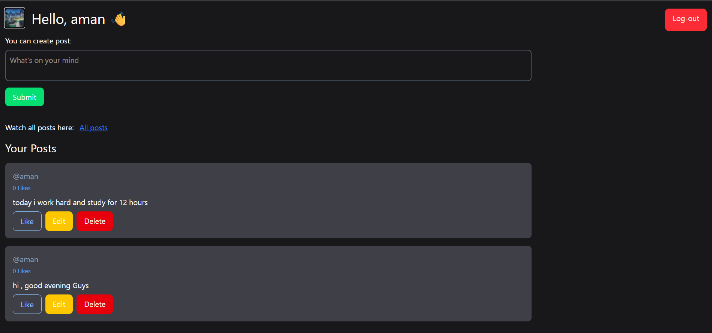
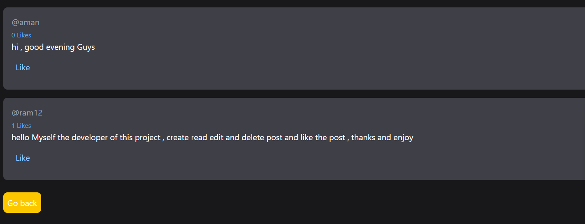
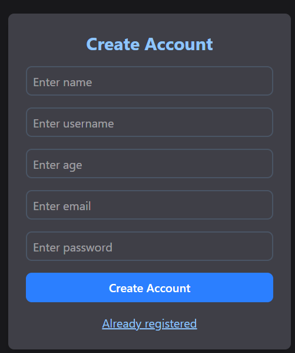
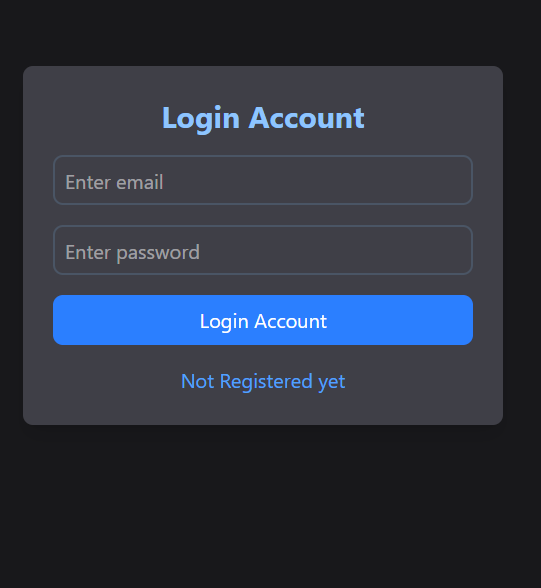

# Backend_PostsApp
A fullstack social post web application built with Node.js, Express, MongoDB Atlas, and EJS templating.  
Users can register, login, create/edit/delete posts, like posts, and upload profile images. Responsive UI styled with Tailwind CSS. Deployed on Render.

---

## Screenshots

<h4>Profile Page</h4>


<h4>Feeds Page</h4>


<table>
  <tr>
    <td><h4>Register Page</h4></td>
    <td><h4>Login Page</h4></td>
  </tr>
  <tr>
    <td></td>
    <td></td>
  </tr>
</table>

---

## Demo

Try the live demo here: [ClicK Here](https://backend-postsapp.onrender.com)

---

## Features
- User authentication (register/login) with JWT and bcrypt  
- Create, read, update, delete (CRUD) posts  
- Like/unlike posts  
- Upload and display profile images  
- Responsive design with Tailwind CSS  
- Secure backend with Express and MongoDB Atlas  
- Deployment ready for Render platform
---
## Tech Stack
- Node.js
- Express.js
- MongoDB Atlas & Mongoose
- EJS Templating
- Tailwind CSS
- JWT for Authentication
- bcrypt for Password Hashing
- Multer for profile picture

---

## Installation & Setup

1. Clone the repo:  
   ```bash
   git clone https://github.com/jainArihant12/Backend_PostsApp.git
   cd Backend_PostApp
2. Install dependencies:
   ```bash
   npm install
3. Create a .env file in the root directory with the following variables:
    ```bash
    MONGO_URI=your_mongodb_atlas_connection_string
4. Run the app locally:
    ```bash
    npm start

5. Open your browser and go to:
   ```bash
   http://localhost:3000

---

## Usage
- Register a new user account.
- Log in with your credentials.
- Create posts from your profile page.
- View all posts in the feed.
- Like or unlike posts.
- Edit or delete your posts.
- Upload a profile image on your profile page.

